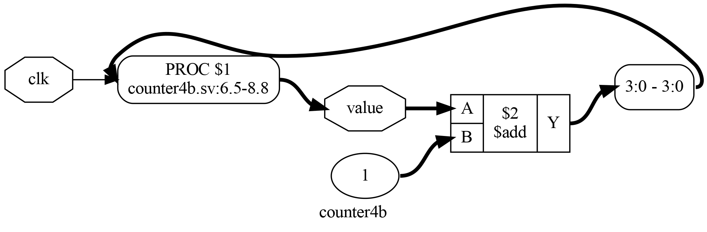
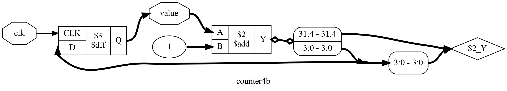
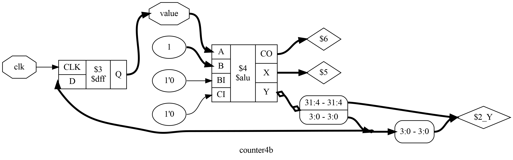
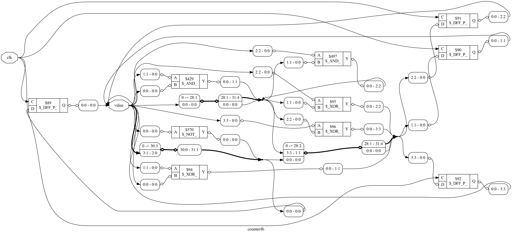
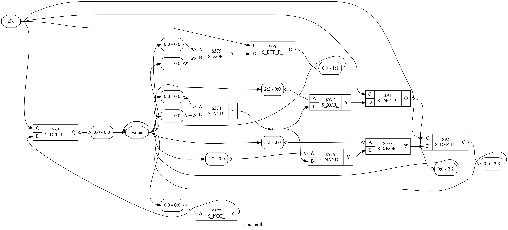
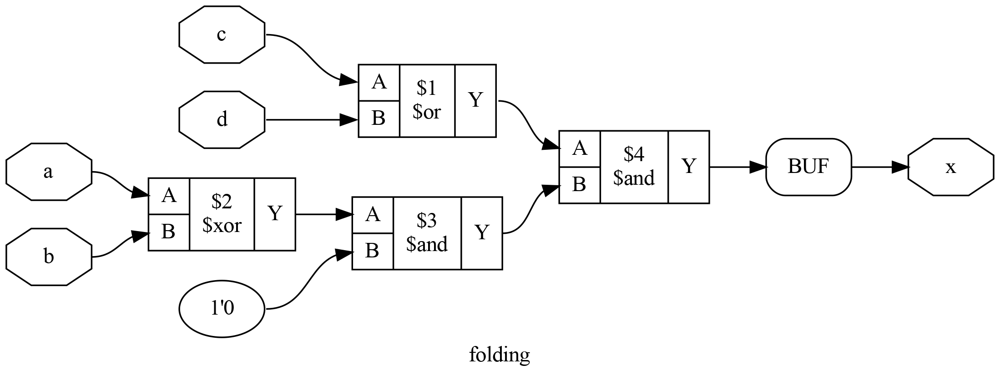
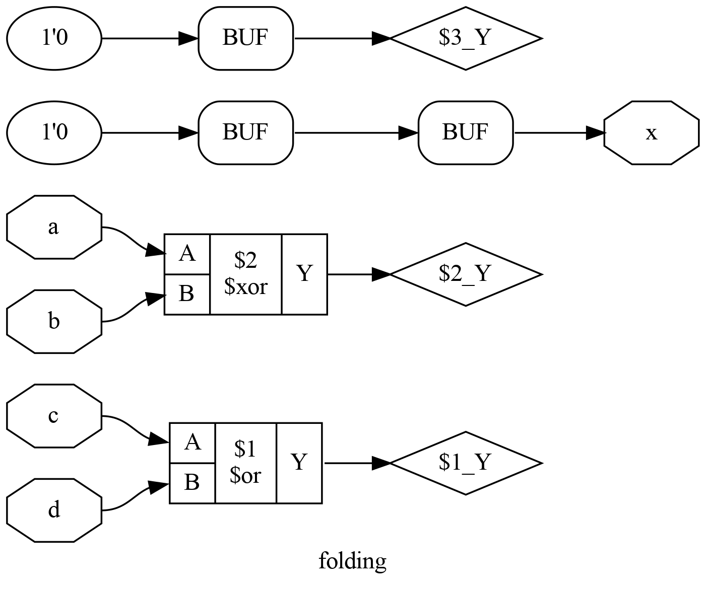
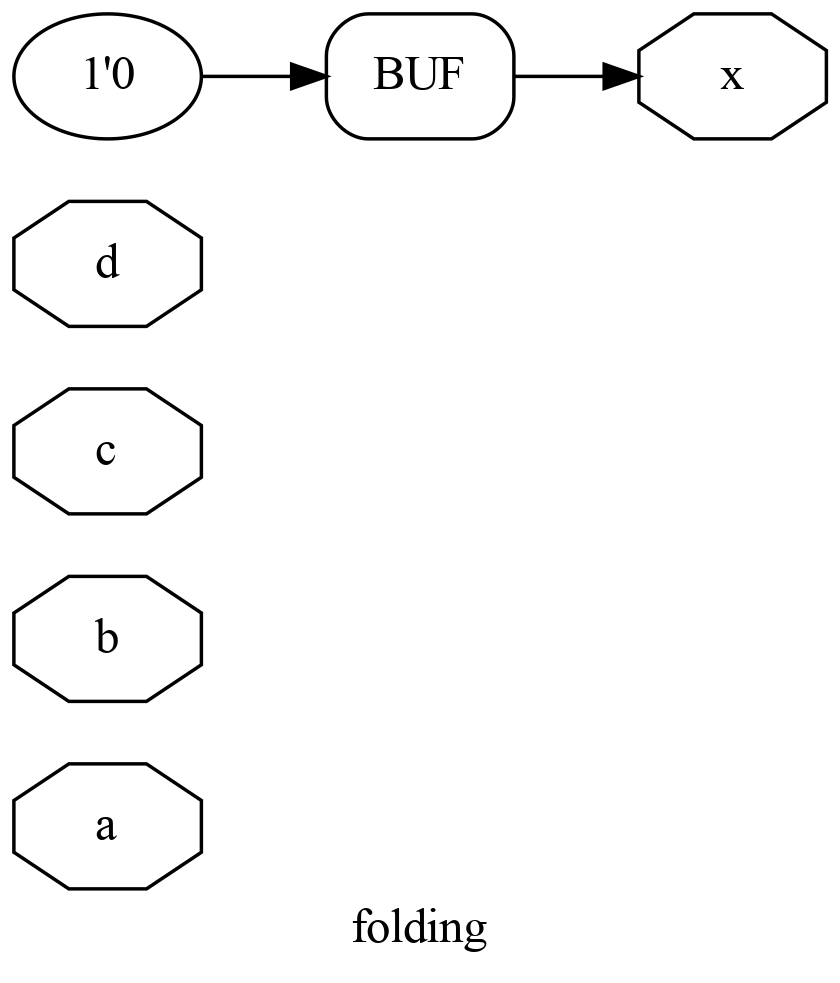
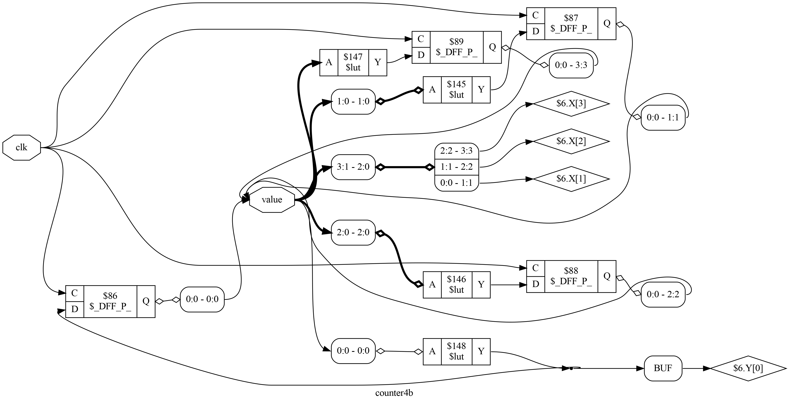

# Yosys Interactive Design Exploration Tutorial

This tutorial is meant to be a starting point to learn how to use Yosys to interactively explore, analyze, and manipulate a digital logic design. You'll want to download the example SystemVerilog files in order to follow along.

(These instructions have been tested with `Yosys version 0.25+83`, using the `oss-cad-suite-linux-x64-20230125` build)

## Analyzing a SystemVerilog file

#### Loading a file

Let's start with this simple Verilog file [counter4b.sv](counter4b.sv) - just a 4 bit counter. Start yosys in interactive mode by running `yosys` in your shell.

```
yosys> read_verilog -sv counter4b.sv

1. Executing Verilog-2005 frontend: counter4b.sv
Parsing SystemVerilog input from `counter4b.sv' to AST representation.
Generating RTLIL representation for module `\counter4b'.
Successfully finished Verilog frontend.
```

#### Writing back the internal representation

We can see how Yosys has understood this Verilog by using the `write_*` commands. These commands take whatever Yosys's current state is, and write it out (to the terminal or to a file). In the same Yosys shell as before:

```
yosys> write_verilog -sv

2. Executing Verilog backend.

2.1. Executing BMUXMAP pass.

2.2. Executing DEMUXMAP pass.

2.3. Executing BWMUXMAP pass.
/* Generated by Yosys 0.25+83 (git sha1 755b753e1, clang 10.0.0-4ubuntu1 -fPIC -Os) */
Dumping module `\counter4b'.
Warning: Module counter4b contains unmapped RTLIL processes. RTLIL processes
can't always be mapped directly to Verilog always blocks. Unintended
changes in simulation behavior are possible! Use "proc" to convert
processes to logic networks and registers.
```

```verilog
(* cells_not_processed =  1  *)
(* src = "counter4b.sv:1.1-10.10" *)
module counter4b(value, clk);
  (* src = "counter4b.sv:6.5-8.8" *)
  reg [3:0] _0_;
  (* src = "counter4b.sv:7.18-7.27" *)
  wire [31:0] _1_;
  (* src = "counter4b.sv:3.17-3.20" *)
  input clk;
  wire clk;
  (* src = "counter4b.sv:2.24-2.29" *)
  output [3:0] value;
  reg [3:0] value;
  assign _1_ = value + (* src = "counter4b.sv:7.18-7.27" *) 32'd1;
  always_comb begin
    _0_ = _1_[3:0];
  end
  always_ff @(posedge clk) begin
      value <= _0_;
  end
endmodule
```

We note that Yosys tries very hard to keep track of the line-numbers from the original source files. This can be very useful in some use-cases, but for now we can turn it off with the `noattr` flag.

```
yosys> write_verilog -sv -noattr

3. Executing Verilog backend.

3.1. Executing BMUXMAP pass.

3.2. Executing DEMUXMAP pass.

3.3. Executing BWMUXMAP pass.
/* Generated by Yosys 0.25+83 (git sha1 755b753e1, clang 10.0.0-4ubuntu1 -fPIC -Os) */
Dumping module `\counter4b'.
Warning: Module counter4b contains unmapped RTLIL processes. RTLIL processes
can't always be mapped directly to Verilog always blocks. Unintended
changes in simulation behavior are possible! Use "proc" to convert
processes to logic networks and registers.
```

```verilog
module counter4b(value, clk);
  reg [3:0] _0_;
  wire [31:0] _1_;
  input clk;
  wire clk;
  output [3:0] value;
  reg [3:0] value;
  assign _1_ = value + 32'd1;
  always_comb begin
    _0_ = _1_[3:0];
  end
  always_ff @(posedge clk) begin
      value <= _0_;
  end
endmodule
```

This looks a lot cleaner, and we can see there's a bunch of things that Yosys has figured out. It has intelligently converted the `logic` type to explicit `reg` and `wire` types. Other than that, the code is more-or-less equivalent to the original `counter4b.sv`, just with some variable names stripped out and replaced with internal representations.

Side note: Datatypes in Verilog are confusing because they don't actually represent registers and wires; instead `reg` is used in `always` blocks, while `wire` is used with `assign` statements and module I/Os.

#### The hierarchy pass

The `hierarchy` command is used to handle certain Verilog features used in hierarchical designs, like instance arrays and parameters. For simple designs like this one, it doesn't do much.

```
yosys> hierarchy

4. Executing HIERARCHY pass (managing design hierarchy).
```

## Visualizations and Synthesis

#### Visualizing a basic design using GraphViz

Now, we're going to try synthesizing a design "manually", by invoking each of the individual Yosys steps that are used during a synthesis operation (as opposed to the built-in `synth_*` commands). Open a new interactive instance of Yosys.

```
yosys> read_verilog -sv counter4b.sv

1. Executing Verilog-2005 frontend: counter4b.sv
Parsing SystemVerilog input from `counter4b.sv' to AST representation.
Generating RTLIL representation for module `\counter4b'.
Successfully finished Verilog frontend.

yosys> show

2. Generating Graphviz representation of design.
Writing dot description to `/home/anish/.yosys_show.dot'.
Dumping module counter4b to page 1.
```

If GraphViz launches successfully, you should see something that looks like this:



We note that:

- The `PROC` block represents the fact that Yosys still sees the `always` block as a behavioral logic block (containing things like assignments, `if` statements, `case` statements, etc.), which needs to be processed and turned into a logic circuit.
- The `$add` is an abstracted arbitrary-width binary adder, which can be turned into a logic circuit depending on what process we are synthesizing to (i.e. an FPGA may have dedicated logic blocks for addition, while an adder in an ASIC might be made from AND/OR/XOR gates).

Some other hints for understanding the visualization:

- Octagonal boxes are I/Os of the module being looked at. 
- Rectangular boxes are internal cells. 
- Ellipses are constant values
- A thin arrow is a single-bit connection, while a thick arrow is a multi-bit wire
- The rounded-corner boxes marked with PROC are behavioral process blocks
- The rounded-corner boxes that look like "3:0 - 3:0" are signal vector breakout boxes, which are used to indicate when certain bits of a signal are extracted.

#### Behavioral process elaboration

Now, let's get into **design elaboration**. We start with the `proc` command. We'll also use the `opt` command. This is recommended to do after every single Yosys command, because most passes will leave a lot of junk in the design (such as extraneous unused cells, debug info, and the like).

```
yosys> proc; opt; show
```



This doesn't look too different from before. However, we note that the `PROC` block has been processed and converted into a `$dff` cell (a multi-bit flip flop). Despite the `opt` pass, there's still some unused junk left in the design, but this will be removed later in the process.

#### Arithmetic logic extraction

Next, we run the `alumacc` pass. This pass handles all sorts of arithmetic logic (adders, comparators, multipliers, etc.) Because so many processes have special logic to handle arithmetic (like fast-carry and DSP blocks in FPGAs), Yosys also has special handling for them

It turns out that adders (and things similar to adders like comparators and multipliers) are so important in a complicated design that Yosys has a special pass to handle them... FPGAs often have special logic, stuff like faster carry-chains, etc.

```
yosys> alumacc; opt; show
```



We see that the adder has been replaced with a more generic `$alu` block. Since we still haven't told Yosys what backing technology we're working with, everything is being done using these highly-abstracted blocks. Later on, these `$alu` blocks can be replaced with pre-optimized implementations of their arithmetic expressions for whatever platform we're working with.

#### Techmapping

Next, we'll run the `techmap` pass to actually map the design down into basic logic gates. Since we haven't provided Yosys with a cell-library or technology backend to work with, it defaults to using a standard set of logic gates.

```
yosys> techmap; opt; show
```



Because we're not targeting a specific architecture like an FPGA, the special cells all just get turned into basic logic gates, in Yosys internal format. Also, everything becomes one-bit signals. This is called a "gate-level" representation. One important thing to note is that techmap doesn't optimize, it just drop-in replaces the higher-level abstractions (the lowercase named blocks) with low-level abstractions (generic logic gates, DFFs, etc.).

#### Splitnets

Many of the internal Yosys operations use wider signals than are actually required, which is why so many signals in the visualization are converted into 32-bit-wide signals and then immediately back to one-bit-wide signals. For synthesis, this is not a problem because Yosys will eventually clean everything up at the end, but for visualization we can use `splitnets` to clean up the signals (this will split everything into one-bit-wide signals wherever possible, which is very effective when working at the single-logic-gate level.

```
yosys> splitnets; opt; show
```


This looks a lot cleaner, and we can actually trace out the full logic circuit here by looking closely.

#### ABC Logic Synthesis

Next comes the logic-mapping step, where we take the base gate-level representation and map it down into our final cell library. Because we're not targeting a specific FPGA or PDK library, we'll just use Yosys's default internal set of logic-gates.

ABC is arguably the most complicated part of Yosys. It's really [its own program](https://people.eecs.berkeley.edu/~alanmi/abc/) that Yosys wraps to use as its internal logic-optimizer. Since this is such a simple design, ABC didn't really change anything. For a more-complex design, ABC would be doing most of the heavy-lifting when logic-mapping the design.

```
yosys> abc; opt; show
```



#### Design Statistics

We can use the `stat` command to look at statistics about our design, including wires, cells, etc. If the design contains un-flattened hierarchy, we'd see the hierarchical representation of the modules in the design as well.

```
yosys> stat

19. Printing statistics.

=== counter4b ===

   Number of wires:                  8
   Number of wire bits:             11
   Number of public wires:           2
   Number of public wire bits:       5
   Number of memories:               0
   Number of memory bits:            0
   Number of processes:              0
   Number of cells:                 10
     $_AND_                          1
     $_DFF_P_                        4
     $_NAND_                         1
     $_NOT_                          1
     $_XNOR_                         1
     $_XOR_                          2
```

#### Exporting the gate-level design

We can export the resultant gate-level design in several formats. One option is to export as Verilog:

```
yosys> write_verilog -sv -noattr

20. Executing Verilog backend.

20.1. Executing BMUXMAP pass.

20.2. Executing DEMUXMAP pass.

20.3. Executing BWMUXMAP pass.
/* Generated by Yosys 0.25+83 (git sha1 755b753e1, clang 10.0.0-4ubuntu1 -fPIC -Os) */
Dumping module `\counter4b'.
```

```verilog
module counter4b(value, clk);
  wire _00_;
  wire _01_;
  wire _02_;
  wire _03_;
  wire _04_;
  wire _05_;
  input clk;
  wire clk;
  output [3:0] value;
  reg [3:0] value;
  assign _00_ = ~value[0];
  assign _04_ = value[0] & value[1];
  assign _01_ = value[0] ^ value[1];
  assign _05_ = ~(value[2] & _04_);
  assign _02_ = value[2] ^ _04_;
  assign _03_ = ~(value[3] ^ _05_);
  always_ff @(posedge clk)
    value[0] <= _00_;
  always_ff @(posedge clk)
    value[1] <= _01_;
  always_ff @(posedge clk)
    value[2] <= _02_;
  always_ff @(posedge clk)
    value[3] <= _03_;
endmodule

```

More usefully, we can export the design as JSON. This is incredibly powerful as it allows Yosys to be used as a general-purpose Verilog frontend and logic synthesis tool, and then feed the results into your own software for purposes of simulation, rendering, further analysis, etc.

```
yosys> write_json design.json

21. Executing JSON backend.
```

In the JSON file you can see all the attributes, cells, ports, and net-names. 

```
{
  "creator": "Yosys 0.25+83 (git sha1 755b753e1, clang 10.0.0-4ubuntu1 -fPIC -Os)",
  "modules": {
    "counter4b": {
      "attributes": {
        "cells_not_processed": "00000000000000000000000000000001",
        "src": "counter4b.sv:1.1-10.10"
      },
      "ports": {
        "value": {
          "direction": "output",
          "bits": [ 2, 3, 4, 5 ]
        },
        "clk": {
          "direction": "input",
          "bits": [ 6 ]
        }
      },
      "cells": {
        "$abc$572$auto$blifparse.cc:386:parse_blif$573": {
          "hide_name": 1,
          "type": "$_NOT_",
          "parameters": {
          },
          "attributes": {
          },
          "port_directions": {
            "A": "input",
            "Y": "output"
          },
          "connections": {
            "A": [ 2 ],
            "Y": [ 7 ]
          }
        },

        ...

      },
      "netnames": {

      	...

        "clk": {
          "hide_name": 0,
          "bits": [ 6 ],
          "attributes": {
            "src": "counter4b.sv:3.17-3.20"
          }
        },
        "value": {
          "hide_name": 0,
          "bits": [ 2, 3, 4, 5 ],
          "attributes": {
            "src": "counter4b.sv:2.24-2.29"
          }
        }
      }
    }
  }
}
...
```


## Optimizations

#### Background

Yosys has several optimization passes:

- `opt_muxtree` - Remove dead inputs in multiplexers
- `opt_reduce` - Consolidate AND/OR/MUX trees
- `opt_merge` - Combine redundant cells (same connections)
- `opt_dff` - Combine the "enable" and "reset" inputs into DFFs
- `opt_clean` - Remove unused or unconnected cells
- `opt_expr` - Constant-folding on internal cells
- `opt` - **Run all of the optimization passes, in a loop, repeatedly**


## Constant-folding example

As an example, let's look at how constant-folding works. Start a new interactive Yosys session. We'll be working with the following Verilog file [folding.sv](folding.sv):

```verilog
module folding (
    output logic x,
    input logic a, b, c, d
);

    assign x = (c | d) & ((a ^ b) & 1'b0);

endmodule
```

First, load in the design and visualize it, WITHOUT running any opt commands:

```
yosys> read_verilog -sv folding.sv
1. Executing Verilog-2005 frontend: folding.sv
Parsing SystemVerilog input from `folding.sv' to AST representation.
Generating RTLIL representation for module `\folding'.
Successfully finished Verilog frontend.

yosys> show

2. Generating Graphviz representation of design.
Writing dot description to `/home/anish/.yosys_show.dot'.
Dumping module folding to page 1.
```



By tracing through the logic circuit, we can very clearly see that the result will _always_ evaluate to zero. Let's see if Yosys can figure this out as well.

```
yosys> opt_expr; show

3. Executing OPT_EXPR pass (perform const folding).
Optimizing module folding.
<suppressed ~2 debug messages>

4. Generating Graphviz representation of design.
Writing dot description to `/home/anish/.yosys_show.dot'.
Dumping module folding to page 1.
```

The `opt_expr` pass has figured out that output `x` is just going to be zero, and as such has just directly connected it to zero.



However, there's still a lot of junk in the design, because `opt_expr` doesn't clean up any unused logic. Next, we can use the `opt_clean` pass:

```
yosys> opt_clean; show

5. Executing OPT_CLEAN pass (remove unused cells and wires).
Finding unused cells or wires in module \folding..
Removed 2 unused cells and 4 unused wires.
<suppressed ~3 debug messages>

6. Generating Graphviz representation of design.
Writing dot description to `/home/anish/.yosys_show.dot'.
Dumping module folding to page 1.
```

Now, we can see that it has removed all the unused nets, along with getting rid of the unused BUFs as well. 



We can also write out the design to Verilog and see that it's exactly what we'd expect:

```
yosys> write_verilog -sv -noattr

7. Executing Verilog backend.

7.1. Executing BMUXMAP pass.

7.2. Executing DEMUXMAP pass.

7.3. Executing BWMUXMAP pass.
/* Generated by Yosys 0.25+83 (git sha1 755b753e1, clang 10.0.0-4ubuntu1 -fPIC -Os) */
Dumping module `\folding'.
```

```verilog
module folding(x, a, b, c, d);
  input a;
  wire a;
  input b;
  wire b;
  input c;
  wire c;
  input d;
  wire d;
  output x;
  wire x;
  assign x = 1'h0;
endmodule
```

## LUT Mapping using Synth Command

Other than the individual manipulations and commands available in Yosys, there's also some built-in `synth_X` commands which can be used to synthesize to a specific target.

As of Yosys 0.25, the list of builtin synthesis scripts includes:

```
synth                generic synthesis script
synth_achronix       synthesis for Acrhonix Speedster22i FPGAs.
synth_anlogic        synthesis for Anlogic FPGAs
synth_coolrunner2    synthesis for Xilinx Coolrunner-II CPLDs
synth_easic          synthesis for eASIC platform
synth_ecp5           synthesis for ECP5 FPGAs
synth_efinix         synthesis for Efinix FPGAs
synth_fabulous       FABulous synthesis script
synth_gatemate       synthesis for Cologne Chip GateMate FPGAs
synth_gowin          synthesis for Gowin FPGAs
synth_greenpak4      synthesis for GreenPAK4 FPGAs
synth_ice40          synthesis for iCE40 FPGAs
synth_intel          synthesis for Intel (Altera) FPGAs.
synth_intel_alm      synthesis for ALM-based Intel (Altera) FPGAs.
synth_machxo2        synthesis for MachXO2 FPGAs. This work is experimental.
synth_nexus          synthesis for Lattice Nexus FPGAs
synth_quicklogic     Synthesis for QuickLogic FPGAs
synth_sf2            synthesis for SmartFusion2 and IGLOO2 FPGAs
synth_xilinx         synthesis for Xilinx FPGAs
```

The generic `synth` command can be used to synthesize to basic logic-gates or LUTs. 

As per the Yosys documentation, the `synth` command is implemented as the following sequence of commands:

```
begin:
    hierarchy -check [-top <top> | -auto-top]

coarse:
    proc
    flatten      (if -flatten)
    opt_expr
    opt_clean
    check
    opt -nodffe -nosdff
    fsm          (unless -nofsm)
    opt
    wreduce
    peepopt
    opt_clean
    techmap -map +/cmp2lut.v -map +/cmp2lcu.v     (if -lut)
    alumacc      (unless -noalumacc)
    share        (unless -noshare)
    opt
    memory -nomap
    opt_clean

fine:
    opt -fast -full
    memory_map
    opt -full
    techmap
    techmap -map +/gate2lut.v    (if -noabc and -lut)
    clean; opt_lut               (if -noabc and -lut)
    flowmap -maxlut K            (if -flowmap and -lut)
    opt -fast
    abc -fast           (unless -noabc, unless -lut)
    abc -fast -lut k    (unless -noabc, if -lut)
    opt -fast           (unless -noabc)

check:
    hierarchy -check
    stat
    check
```

#### What is a LUT?

LUT is short for lookup table, and is a primitive used to implement combinational logic in almost all FPGAs. An N-bit LUT is a unit that can implement any logic function with N bits of input and one bit of output, with the logic function being defined in the form of a truth table. Each entry of the truth table is programmed into the "configuration bits" of the LUT (which are usually single-bit registers) and this allows the LUT to then implement the chosen logic function.

#### Synthesizing to LUTs

As an example, we'll take a 4-bit counter design and synthesize it to LUTs. Take a look at `counter4b.sv`, which implements a simple 4-bit counter. Start a new Yosys session. We'll synthesize this counter to be made from 4-input LUTs.

```
yosys> read_verilog -sv counter4b.sv

1. Executing Verilog-2005 frontend: counter4b.sv
Parsing SystemVerilog input from `counter4b.sv' to AST representation.
Generating RTLIL representation for module `\counter4b'.
Successfully finished Verilog frontend.

yosys> synth -lut 4

2. Executing SYNTH pass.

2.1. Executing HIERARCHY pass (managing design hierarchy).

...

2.26. Printing statistics.

=== counter4b ===

   Number of wires:                  4
   Number of wire bits:             13
   Number of public wires:           2
   Number of public wire bits:       5
   Number of memories:               0
   Number of memory bits:            0
   Number of processes:              0
   Number of cells:                  8
     $_DFF_P_                        4
     $lut                            4
```

As we'd expect for a 4-bit counter, the utilization is 4 LUTs. If we had a 5-bit counter, then we'd need 6 LUTs. We can now run a `splitnets` followed by an `opt` and then use `show` to see the design:

```
yosys> splitnets; opt
yosys> show
```

We can see the LUT-based implementation of the counter circuit:



Additionally, we can also export the design as JSON or Verilog. The JSON format would be particularly useful if we wanted to, say, use this as part of a custom FPGA flow.

```
yosys> write_verilog -sv -noattr -noexpr design_lut.sv
```

```verilog
module counter4b(value, clk);
  wire _00_;
  wire _01_;
  wire _02_;
  wire _03_;
  input clk;
  wire clk;
  output [3:0] value;
  wire [3:0] value;
  \$lut  #(
    .LUT(4'h6),
    .WIDTH(32'd2)
  ) _04_ (
    .A(value[1:0]),
    .Y(_01_)
  );
  \$lut  #(
    .LUT(8'h78),
    .WIDTH(32'd3)
  ) _05_ (
    .A(value[2:0]),
    .Y(_02_)
  );
  \$lut  #(
    .LUT(16'h7f80),
    .WIDTH(32'd4)
  ) _06_ (
    .A(value),
    .Y(_03_)
  );
  \$lut  #(
    .LUT(2'h1),
    .WIDTH(32'd1)
  ) _07_ (
    .A(value[0]),
    .Y(_00_)
  );
  \$_DFF_P_  \value_reg[0]  /* _08_ */ (
    .C(clk),
    .D(_00_),
    .Q(value[0])
  );
  \$_DFF_P_  \value_reg[1]  /* _09_ */ (
    .C(clk),
    .D(_01_),
    .Q(value[1])
  );
  \$_DFF_P_  \value_reg[2]  /* _10_ */ (
    .C(clk),
    .D(_02_),
    .Q(value[2])
  );
  \$_DFF_P_  \value_reg[3]  /* _11_ */ (
    .C(clk),
    .D(_03_),
    .Q(value[3])
  );
endmodule
```

## Next Steps

Hopefully this guide has helped you get a basic understanding of how to use Yosys to load and manipulate designs. 

As a next step, check out the [Yosys Interactive Design Investigation tutorial](https://yosyshq.readthedocs.io/projects/yosys/en/latest/appendix/APPNOTE_011_Design_Investigation.html), which goes further into depth on how to manipulate and analyze smaller components of a design, and how to use the SAT solver to prove properties about the design.

Additionally, the [Yosys manual](https://yosyshq.readthedocs.io/projects/yosys/en/latest/) discusses other important concepts and includes a reference of all of the commands available in Yosys.


